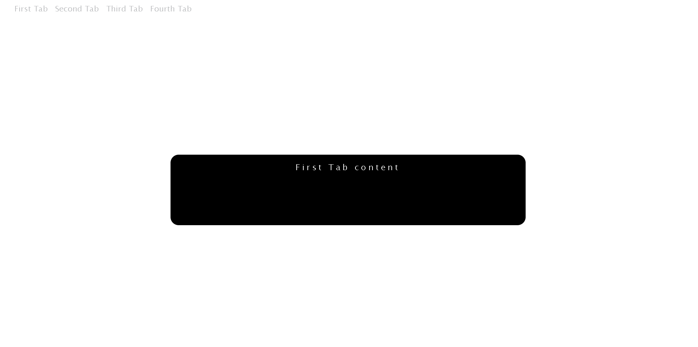

# Tabs

Proyecto en donde se puede ver distintos elementos en el cual al hacer click sobre el mismo se mostrará el texto relacionado. 

## Tecnologías Utilizadas

- HTML
- CSS
- Javascript

## Instrucciones para Correr el Proyecto

Opción 1: Abrir directamente el archivo index.html

Abre el archivo index.html en tu navegador favorito.

Opción 2: Usar un servidor local (opcional)

1. Abre el proyecto con Visual Studio Code.
2. Instala la extensión Live Server si no la tienes.
3. Haz clic derecho sobre el archivo index.html y selecciona "Open with Live Server".

# URL del proyecto

```bash
https://roadmap.sh/projects/simple-tabs
```

### 1. Clonar el Repositorio

Primero, clona el repositorio en tu máquina local utilizando Git:

```bash
git clone https://github.com/MatiasCardoso4/Tabs
```
# Images 


